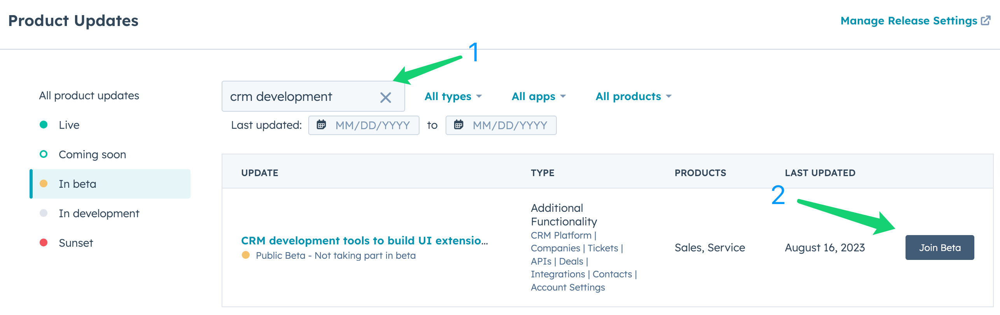

# ChatBees HubSpot UI Extension Project

This project provides a comprehensive demonstration of the ChatBees Chatbot integrated with HubSpot.

## Prerequisites

Before you can utilize this project, there are a few prerequisites that need to be met.

* ChatBees Prerequisites
    - An active [ChatBees](https://chatbees.ai) account is required.
    - A [collection](https://docs.chatbees.ai/chatbees/web-app-references/manage-collections) with
      relevant [data sources](https://docs.chatbees.ai/chatbees/web-app-references/manage-collections/data-sources)
      should be added.
    - An [API key](https://docs.chatbees.ai/chatbees/web-app-references/api-keys) is needed for secure access to the
      collection.

* HubSpot Prerequisites
    - An active HubSpot account is required.
    - The [HubSpot CLI](https://www.npmjs.com/package/@hubspot/cli) should be installed and configured.
    - A Sales Hub or Service Hub Enterprise subscription or a developer test account. If necessary, create developer
      projects. Currently, developer projects are
      available [in public beta under "CRM Development Tools"](https://app.hubspot.com/l/whats-new/betas).




## Usage

### Initialize HubSpot Account

```bash
hs init
```

### Setup ChatBees Secrets

Enter the secret after each command below when prompted:

```bash
hs secrets add CHATBEES_AID
hs secrets add CHATBEES_COLLECTION_NAME
hs secrets add CHATBEES_API_KEY
hs secrets add CHATBEES_MAX_REFS # optional, defaults to 3
hs secrets list # list all secrets
```

### Upload this Extension to your HubSpot Account

```bash
hs project upload
```

You can now customize the right sidebars of the Contacts and Tickets sections in HubSpot to include a `ChatBees` card.

## Local Development

The HubSpot CLI allows you to run this project locally for quick testing and iteration. To get started, create a `.env`
file under `src/app/app.functions` with all the secrets.

```bash
CHATBEES_AID=YOUR_CHATBEES_ACCOUNT_CODE
CHATBEES_COLLECTION_NAME=THE_COLLECTION_NAME
CHATBEES_API_KEY=YOUR_API_KEY
```

Then execute the following HubSpot CLI command in your project directory and follow the prompts:

```bash
hs project dev
```
